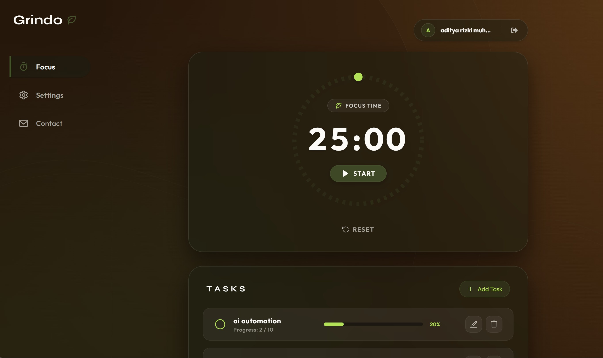
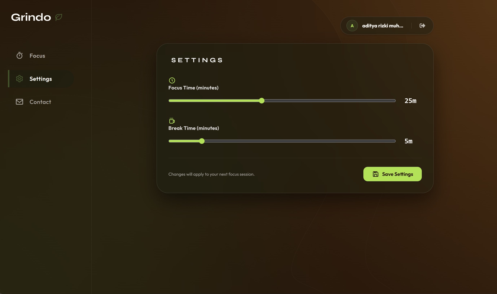

# Grindo 🍃

**Grindo** is a sleek, modern, and focused task management & Pomodoro application built with Next.js, React, Tailwind CSS, and Supabase. Designed with a dark espresso glassmorphism aesthetic to minimize distractions and boost productivity.

---

## 📷 Previews

### Focus Timer & Tasks


### Settings Panel


---

## ✨ Features

- ⏱️ **Pomodoro Focus Timer**: Interactive countdown timer with customizable focus and break sessions.
- 📋 **Task Management**: Create, edit, increment progress, and track daily goals.
- ⚙️ **Customizable Settings**: Adjust focus and break durations with persistent local storage / user preferences.
- 🔐 **Authentication & Cloud Sync**: Supabase Auth integration with guest mode (local storage) fallback.
- 🎨 **Theme-Matched 404 Not Found Page**: Custom tab routing validation ensuring invalid parameters redirect smoothly to a styled 404 page.

---

## 🛠️ Tech Stack

- **Framework**: [Next.js 16 (App Router)](https://nextjs.org/)
- **UI & Styling**: [React 19](https://react.dev/), [Tailwind CSS v4](https://tailwindcss.com/)
- **Icons**: [React Icons](https://react-icons.github.io/react-icons/)
- **Backend / Auth**: [Supabase SSR](https://supabase.com/)
- **Typography**: [Syne](https://fonts.google.com/specimen/Syne) & [Outfit](https://fonts.google.com/specimen/Outfit) via `next/font`

---

## 🚀 Getting Started

### Prerequisites

Ensure you have Node.js 18+ installed on your machine.

### Installation

1. Clone the repository:
   ```bash
   git clone https://github.com/arizki787/Grindo.git
   cd Grindo
   ```

2. Install dependencies:
   ```bash
   npm install
   ```

3. Set up environment variables:
   Create a `.env.local` file in the root directory:
   ```env
   NEXT_PUBLIC_SUPABASE_URL=your-supabase-url
   NEXT_PUBLIC_SUPABASE_ANON_KEY=your-supabase-anon-key
   ```

4. Start the development server:
   ```bash
   npm run dev
   ```

5. Open [http://localhost:3000](http://localhost:3000) in your browser.

